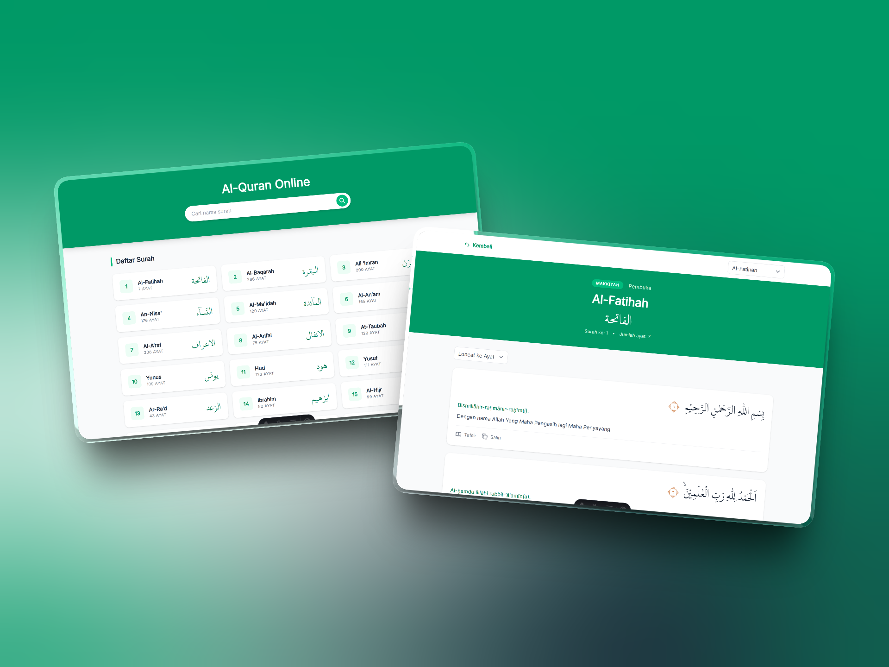

# Qur'an

Website untuk baca Al-Qur'an online, lengkap 30 juz, arab, latin, terjemah dan tafsir ringkas. Cek di [https://ibrahimalanshor.github.io/quran](https://ibrahimalanshor.github.io/quran).

Sumber data : [Qur'an Kemenag](https://quran.kemenag.go.id/). Data dapat diunduh di [Repository Quran Data](https://github.com/ibrahimalanshor/quran-data) dalam bentuk `.csv`.

## Fitur

- Daftar Surah Lengkap
- Baca Per Surah
- Detail Ayat, Teks Latin, Terjemah, Catatan kaki dan Tafsir
- Salin Ayat dan Tafsir
- Navigasi Surah dan Ayat